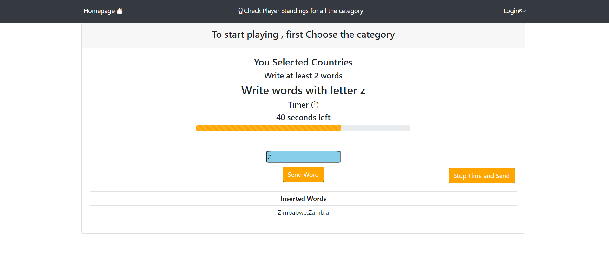

# Exam #1: Categories

## Student: s299444 DI CIAULA ROBERTO

## React Client Application Routes

- Route `/`: `Homepage`, Rules, buttons to start playing unlogged or logged NavBar Always displayed, to Login, go to the leaderboards and combeackto homepage.
- Route `/leaderboard`: `LeaderBoard` page with the leaderboards of the best players.
- Route `/LoginForm`: `LoginForm` Redirected here using the navbar clicking on login , permits to log in and then redirect to homepage.
- Route `play`: `GameTable` After clicking on play here is the main part of the site where users can play the game.

## API Server

- GET `/api/session/current`
  - response body content - {user: info about the user}
- POST `/api/session`
  - response body content - {user: info about the user}
- DELETE `/api/session/current`
  - response body content - {end, logout}
- GET `/api/leaderboards/:category`
  - request parameters - {category}
  - response body content - {user with the highest score for that category}
- POST `/api/round`
  - request body - {req.body.idRound, req.body.idUser,req.body.Letter,req.body.Word,req.body.Category,req.body.Score)
  - response body content - {true}
- GET `/api/Validate/:Category/:Word/:Letter`
  - request parameters - {req.params.Category,req.params.Word,req.params.Letter}
  - response body content - {boolean}
- GET `/api/test`
  - response body content - {item : idRound}
- GET `/api/Score/:idUser/:Word/:Category/:Letter`
  - request parameters - {req.params.idUser,req.params.Word,req.params.Category,req.params.Letter}
  - response body content - {Score: score}

## Database Tables

- Table `users` - contains all the informations about the users.
  {email: string}, {name: string}, {hash: string}, {salt: string}, {id: integer}
- Table `PastRounds` - contains all info about the past rounds
  {Letter: string}, {Word: string}, {Category: string}, {idUser: integer}, {idRounds: integer}, {score: integer}
- Table `Words` - contains all the words that users can insert in the game
  {Word: string}, {Category: string}, {Letter: string}

## Main React Components

- `GameTable` (in `GameTable.js`): contains `AddWords.js` and it's where the games starts and users can choose difficult and category, and then will be able to send to the server the round played
- `AddWords` (in `AddWords.js`): Here users can add Words to the game table and they can be checked by the server if they're correct , after there will be displayed the score
- `LeaderBoard` (in `LeaderBoard.js`): Leaderboard that shows the best players on the server with the highest score
- `Homepage` (in `Homepage.js`):Homepage of the site, here you can decide to play Unlogged or Logged games

## Screenshot

## Users Credentials

- john.doe@polito.it, password
- mario.rossi@polito.it, password
- testuser@polito.it, password
- vaibro@polito.it, password
- will.smith@polito.it, legend
